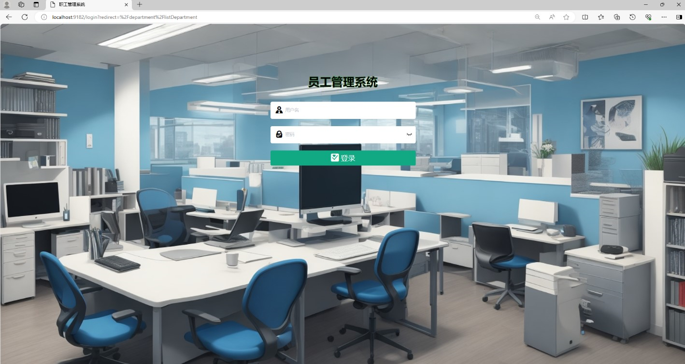
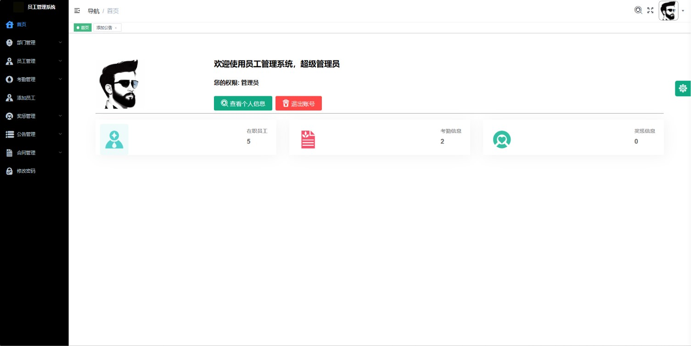
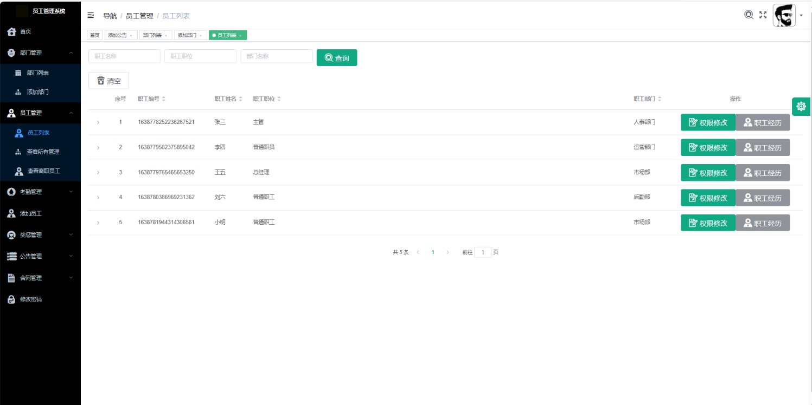
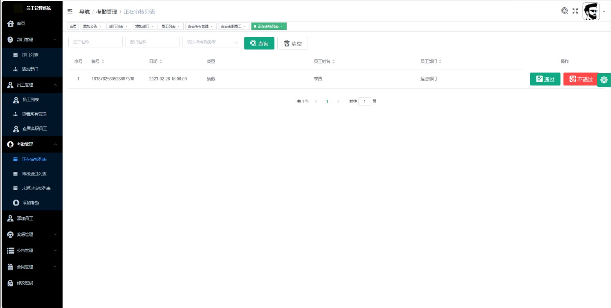
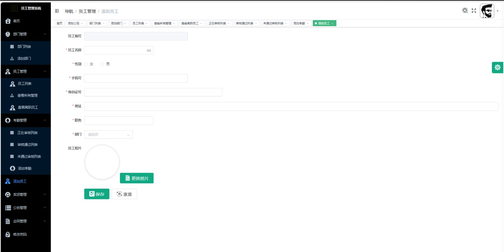
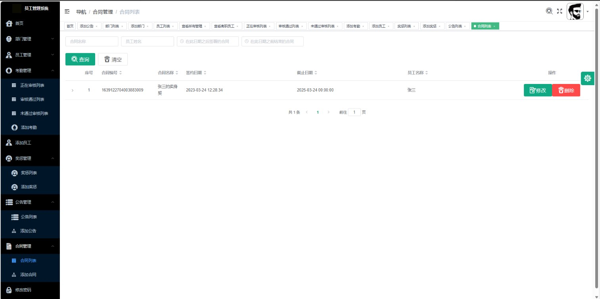

# 员工管理系统

### 9.9￥ 获取完整源码+sql，需要加Q：3577148218 ,微信: qszard26
### 有问题，或者需要协助调试运行项目的也可联系
### 获取更多项目，关注公众号：编程项目集

## 一、介绍

基于springboot+vue的前后端分离员工管理系统

系统角色：管理员、用户

管理员：登录、首页、部门管理、员工管理、考勤管理、添加员工、奖惩管理、公告管理、合同管理、修改密码

用户：登录、首页、公告列表、合同信息、奖惩信息、考勤信息、个人信息、修改密码

## 二、软件架构

语言：java

前端技术：Vue、ElementUI

后端技术：SpringBoot、Mybatis-Plus

数据库：MySQL

运行环境:idea或eclipse vscode

## 三、系统部分功能页面展示

